<a href="#featured-work">Featured work</a>
&nbsp;&nbsp;·&nbsp;&nbsp;
<a href="#research-vector">Research vector</a>
&nbsp;&nbsp;·&nbsp;&nbsp;
<a href="#toolkit">Toolkit</a>
&nbsp;&nbsp;·&nbsp;&nbsp;
<a href="#experiments">Experiments</a>

## What I work on

**Research** — learning-based behavior control for autonomous agents, with an emphasis on imitation learning, reinforcement learning, evaluation, and failure analysis.

`Autonomous agents` `Game AI` `Imitation learning` `Reinforcement learning`

**Engineering** — reliable AI systems with bounded execution, explicit capability maturity, persistent workflows, evidence-aware retrieval, and reproducible delivery.

`Agent runtime` `Retrieval` `Computer vision` `3D perception`

## Featured work

### [PaperClaw ↗](https://github.com/ZyfNO2/PaperClaw) · auditable agent runtime

A bounded runtime for coding, research, retrieval, and multi-agent workflows. Capability maturity is explicit — **shipped**, **foundation**, **experimental**, and **planned** are tracked separately, so prototypes are never presented as production-ready.

`Python` `Multi-agent` `SQLite` `Retrieval`

### [3D Damage Mapping ↗](https://github.com/ZyfNO2/Mapping) · ZED + YOLO + point clouds

A computer-vision pipeline that projects 2D segmentation masks into fused 3D point clouds, applies geometric post-processing, and estimates damaged surface area.

`YOLO` `ZED SDK` `Open3D` `OpenCV`

### [PaperAgent ↗](https://github.com/ZyfNO2/PaperAgent) · research workflow system

A local research application for literature discovery, DOI verification, persistent asynchronous tasks, review, deterministic export, and container delivery.

`FastAPI` `SQLite` `PWA` `Docker`

### [TBS Game ↗](https://github.com/ZyfNO2/TBS_Game) · Unity strategy prototype

A turn-based game prototype used to explore state-driven interaction, gameplay-system composition, configurable behavior, and maintainable Unity implementation patterns.

`Unity` `C#` `Game systems` `Turn-based`

## Research vector

  

The objective is not to replace explicit control blindly, but to compare rule-based, imitation-learning, and reinforcement-learning approaches under clear behavioral and engineering metrics.

## Toolkit

`Python` `C++` `C#` `JavaScript` `PyTorch` `OpenCV` `Open3D` `Unity` `FastAPI` `SQLite` `Docker` `Linux` `Git`

## Experiments

- **[ShaderCollectionV2 ↗](https://github.com/ZyfNO2/ShaderCollectionV2)** — shaders and real-time rendering studies.
- **[ZED-SLAM3R ↗](https://github.com/ZyfNO2/ZED-SLAM3R)** — ZED-based 3D perception experiments.
- **[ZED-Fast-FoundationStereo ↗](https://github.com/ZyfNO2/ZED-Fast-FoundationStereo)** — stereo-depth integration experiments.

---

Current, public, and verifiable work. Experimental and planned capabilities are labeled in their corresponding repositories.

